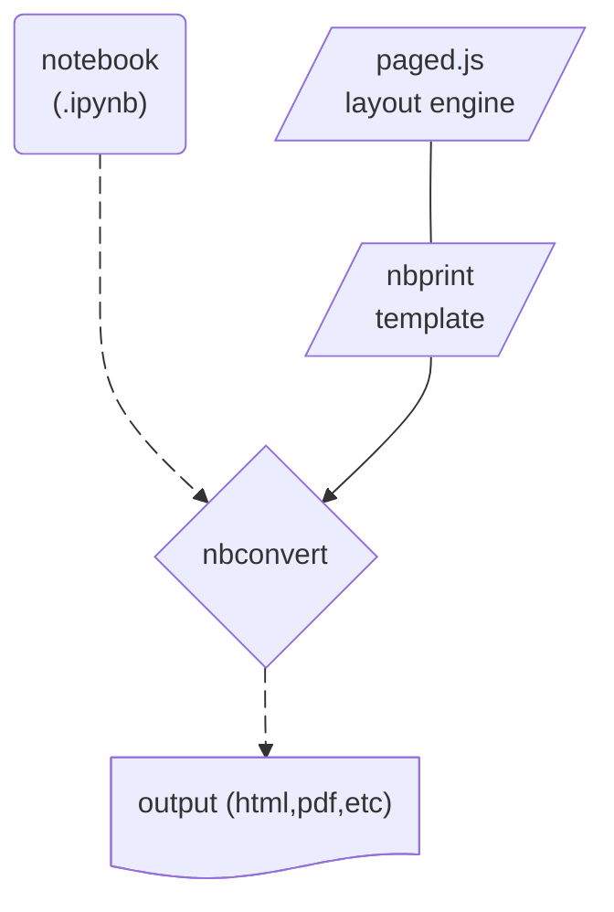
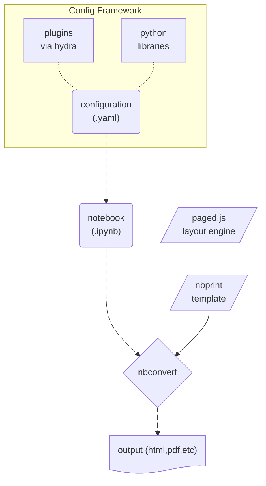
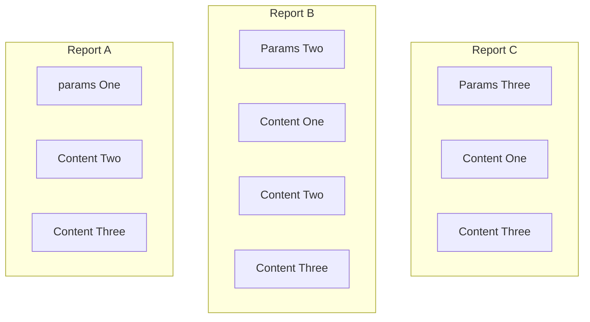

<a href="https://github.com/nbprint/nbprint#gh-light-mode-only">
  </a>
</a>
<a href="https://github.com/nbprint/nbprint#gh-dark-mode-only">
  </a>
</a>
<br/>

A framework for building print media with [nbconvert](https://nbconvert.readthedocs.io).

[](https://github.com/nbprint/nbprint/actions/workflows/build.yaml)
[](https://app.codecov.io/gh/nbprint/nbprint/tree/main)
[](https://github.com/nbprint/nbprint/issues)
[](https://github.com/nbprint/nbprint)
[](https://pypi.python.org/pypi/nbprint)

## Installation

Install with `pip`:

```bash
pip install nbprint
```

Install with `conda`

```bash
conda install nbprint -c conda-forge
```

## Background

Jupyter Notebooks are widely used for reports via [`nbconvert`](https://nbconvert.readthedocs.io/en/latest/). Most efforts focus on building web reports / websites from notebooks, including [`Voilà`](https://github.com/voila-dashboards/voila) and [`Jupyter Book`](https://jupyterbook.org/en/stable/intro.html).

Despite being the primary goal of early notebook conversion efforts, in recent years much less focus has been spent on print media - PDFs for reports, academic papers, newspapers, etc. There are many examples of `nbconvert` templates for academic papers, as well as projects like [`ipypublish`](https://github.com/chrisjsewell/ipypublish/tree/develop). Most of these efforts focus on $\\LaTeX$, and indeed `nbprint` itself started as convenience framework for formatting charts and tables similarly between html and pdf outputs.

However, with recent releases to `nbconvert`, which now supports `webpdf` (printing as pdf from within a headless web browser), and with advances to the `@media print` CSS directive spearheaded by the lovely folks at [`pagedjs`](https://pagedjs.org), it is now much easier to build publication ready print-oriented media on the web.

This is the goal of `nbprint`. Using [`pagedjs`](https://pagedjs.org), `nbprint` provides templates and utilities for building web reports targeting print media. Beyond that, it provides infrastructure for parameterizing and configuring documents via [`pydantic`](https://docs.pydantic.dev/latest/), which makes designing and generating reports a breeze, even without knowledge of Python. Documents are modular and can be easily composed via [`hydra`](https://hydra.cc).

## Quickstart

`nbprint` provides an nbconvert template and a configuration framework.
The simplest example can be run with defaults by calling the `nbprint` executable on an existing notebook:

```bash
nbprint examples/basic.ipynb
```

This CLI supports configuration-driven customization with [hydra](https://hydra.cc) syntax:

```bash
nbprint examples/basic.ipynb +nbprint.name=test ++nbprint.outputs.target=pdf

# First cell is papermill-style parameters
nbprint examples/parameters.ipynb +nbprint.parameters.a=test
```



### Notebook

`nbprint` can be used purely via notebook metadata, but it also provides a `yaml`-based framework for configuration (via [`pydantic`](https://docs.pydantic.dev/latest/), [`hydra`](https://hydra.cc), and [`omegaconf`](https://github.com/omry/omegaconf)).
This is particularly convenient when generating parameterized or componentized reports.



For example, imagine I had a collection of models that I wanted to evaluate for different hyperparameters, where models might have overlapping sets of report elements I want to see.
With `nbprint`'s configuration system, this is easy to compose.



This configuration also allows for easier iteration on a report's design and content.

### Configuration

Let's take a simple placeholder report.

```yaml
---
debug: false
outputs:
  _target_: nbprint:NBConvertOutputs
  path_root: ./outputs
  target: html

content:
  - _target_: nbprint:ContentMarkdown
    content: |
      # A Generic Report
      ## A Subtitle
    css: ":scope { text-align: center; }"

  - _target_: nbprint:ContentPageBreak

  - _target_: nbprint:ContentTableOfContents

  - _target_: nbprint:ContentPageBreak

  - _target_: nbprint:ContentMarkdown
    content: |
      # Section One
      Lorem ipsum dolor sit amet.
      ## Subsection One
      Consectetur adipiscing elit, sed do eiusmod tempor incididunt.
      ## Subsection Two
      Ut labore et dolore magna aliqua.

  - _target_: nbprint:ContentPageBreak

  - _target_: nbprint:ContentFlexRowLayout
    sizes: [1, 1]
    content:
      - _target_: nbprint:ContentFlexColumnLayout
        content:
          - _target_: nbprint:ContentMarkdown
            content: |
              # Section Two
              Lorem ipsum dolor sit amet.
              ## Subsection One
              Consectetur adipiscing elit, sed do eiusmod tempor incididunt.

      - _target_: nbprint:ContentFlexColumnLayout
        content:
          - _target_: nbprint:ContentMarkdown
            content: |
              # Section Three
              Ut labore et dolore magna aliqua.
              ## Subsection One
              Ut enim ad minim veniam, quis nostrud.
```

Let's break this down step by step.

First, we configure `debug: false`. This tells `nbprint` to run `pagedjs` print preview. We also set the output to run `nbconvert` and configure the folder for outputs to be placed.

Next we fill in some content. Here we use a few components:

- `ContentMarkdown` to generate Markdown cells
- `ContentPageBreak` to split onto a new page in our pdf
- `ContentTableOfContents` to create a table of contents. Note that this will work in both html preview, and pdf form!
- `ContentFlexRowLayout` and `ContentFlexColumnLayout` to create some layout structure for our document.

### Run

We can now generate the report by running the CLI:

```bash
nbprint examples/basic.yaml
```

This will create a Notebook output in our specified folder `examples/output`, as well as an html asset (since that is what we specified in the yaml file). Both will have the date as a suffix, which is also configurable in our yaml. We see the generated report notebook, which we can open and use for further experimentation or to investigate the report itself.

</a>

We also see the html document itself, which will be rendered via [`pagedjs`](https://pagedjs.org) print preview.

</a>

You can find a pdf form of this document [here](https://github.com/nbprint/nbprint/raw/main/docs/img/example-basic.pdf?raw=true).

## ccflow integration

`nbprint` is compatible with [ccflow](https://github.com/point72/ccflow) callable models.
`nbprint` outputs like `NBConvertOutputs` inherit from [`ccflow.ResultsBase`](https://github.com/Point72/ccflow/wiki/Workflows#result-type), and `nbprint` parameters like `Parameters` inherit from [`ccflow.ContextBase`](https://github.com/Point72/ccflow/wiki/Workflows#context).

```bash
nbprint-cc +nbprint.name=test +context=[]
```

## Development

**Warning**: This project is under active development, so all APIs are subject to change!

## Related Projects

- [nbconvert](https://nbconvert.readthedocs.io/en/latest/): Convert Notebooks to other formats
- [pagedjs](https://pagedjs.org): Paged.js is a free and open-source library that paginates any HTML content to produce beautiful print-ready PDF
- [Voilà](https://github.com/voila-dashboards/voila): Voilà turns Jupyter notebooks into standalone web applications
- [Jupyter Book](https://jupyterbook.org/en/stable/intro.html): Build beautiful, publication-quality books and documents from computational content
- [ipypublish](https://github.com/chrisjsewell/ipypublish/tree/develop): A workflow for creating and editing publication ready scientific reports and presentations, from one or more Jupyter Notebooks, without leaving the browser!

Additionally, this project relies heavily on:

- [pydantic](https://docs.pydantic.dev/latest/): Pydantic is the most widely used data validation library for Python.
- [hydra](https://hydra.cc): Hydra is a framework for dynamically creating hierarchical configuration by composition, with the ability to override through config files and the command line
- [omegaconf](https://github.com/omry/omegaconf): OmegaConf is a hierarchical configuration system, with support for merging configurations from multiple sources
- [typer](https://typer.tiangolo.com): Typer is a library for building CLI applications based on Python type hints

## License

This software is licensed under the Apache 2.0 license. See the [LICENSE](LICENSE) file for details.

> [!NOTE]
> This library was generated using [copier](https://copier.readthedocs.io/en/stable/) from the [Base Python Project Template repository](https://github.com/python-project-templates/base).
