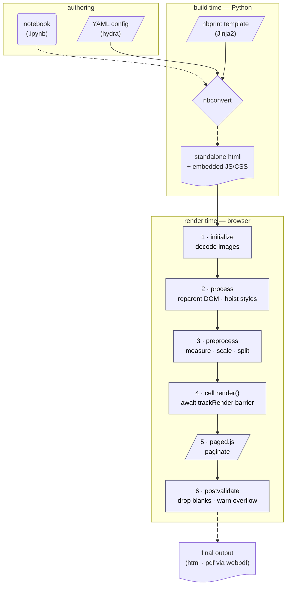

<a class="logo-light" href="https://github.com/nbprint/nbprint#gh-light-mode-only">
  </a>
</a>
<a class="logo-dark" href="https://github.com/nbprint/nbprint#gh-dark-mode-only">
  </a>
</a>
<br/>

A framework for building print media with [`nbconvert`](https://nbconvert.readthedocs.io).

[](https://github.com/nbprint/nbprint/actions/workflows/build.yaml)
[](https://app.codecov.io/gh/nbprint/nbprint/tree/main)
[](https://github.com/nbprint/nbprint/issues)
[](https://github.com/nbprint/nbprint)

## Background

Jupyter Notebooks are widely used for reports via [`nbconvert`](https://nbconvert.readthedocs.io/en/latest/), but most development work has been on enabling building interactive websites. The goal of `nbprint` is to focus on print-oriented workflows, e.g. PDF, by leveraging new developments in `nbconvert` and the [`pagedjs`](https://pagedjs.org) print-oriented layout library.

For a deeper dive, see [the documentation](https://nbprint.github.io/nbprint/index.html).

## Quickstart

`nbprint` provides an `nbconvert` template and a [configuration framework](https://nbprint.github.io/nbprint/docs/src/configuration.html).
The simplest example can be run with defaults by calling the `nbprint` executable on an existing notebook:

```bash
nbprint examples/basic.ipynb
```

This CLI supports configuration-driven customization with [hydra](https://hydra.cc) syntax:

```bash
nbprint examples/basic.ipynb +nbprint.name=test ++nbprint.outputs.target=pdf

# First cell is papermill-style parameters
nbprint examples/parameters.ipynb +nbprint.parameters.a=test

# Overlay a config group, e.g. title and table of contents
nbprint examples/basic.ipynb nbprint/content/frontmatter=nbprint/title_toc
```


```mermaid
graph TB
    subgraph author["authoring"]
        nb("notebook<br>(.ipynb)")
        yaml[/"YAML config<br>(hydra)"/]
    end

    subgraph build["build time — Python"]
        nbc{"nbconvert"}
        nbct[/"nbprint template<br>(Jinja2)"/]
        html@{ shape: doc, label: "standalone html<br>+ embedded JS/CSS" }
    end

    subgraph browser["render time — browser"]
        direction TB
        init["1 · initialize<br>decode images"]
        proc["2 · process<br>reparent DOM · hoist styles"]
        pre["3 · preprocess<br>measure · scale · split"]
        esm["4 · cell render()<br>await trackRender barrier"]
        pjs[/"5 · paged.js<br>paginate"/]
        post["6 · postvalidate<br>drop blanks · warn overflow"]
    end

    out@{ shape: doc, label: "final output<br>(html · pdf via webpdf)" }

    nb e1@--> nbc
    yaml --> nbc
    nbct --> nbc
    e1@{animate: true}

    nbc e2@--> html
    e2@{animate: true}

    html --> init
    init --> proc --> pre --> esm --> pjs --> post

    post e3@--> out
    e3@{animate: true}

    classDef browserPhase fill:#eef,stroke:#557,color:#000
    class init,proc,pre,esm,pjs,post browserPhase
```

nbprint splits work across three stages. Authoring happens in the notebook (plus optional YAML overrides via [hydra](https://hydra.cc)). At **build time**, `nbconvert` runs the nbprint Jinja2 template to emit a single self-contained HTML file with all JS, CSS, and data embedded. At **render time**, the browser does the heavy lifting: reparenting the DOM by parent-id, hoisting global styles, running a preprocessing pass that measures and scales oversized content, awaiting every cell's `render()` function through a [lifecycle barrier](https://nbprint.github.io/nbprint/docs/src/architecture.html#render-lifecycle) so pagination only starts after the DOM is stable, then handing off to [`paged.js`](https://pagedjs.org) for layout, and finally running a postvalidation pass that drops blank pages and surfaces overflow warnings. PDF output is produced by rendering the same HTML with `nbconvert --to webpdf` (headless Chromium); there is no separate PDF codepath.

For more information, see [the architecture documentation](https://nbprint.github.io/nbprint/docs/src/architecture.html).

### Configuration

See the [configuration framework documentation](https://nbprint.github.io/nbprint/docs/src/configuration.html) for more information on building pure YAML-based report workflows with `hydra`.

## Installation

Install with `pip`:

```bash
pip install nbprint
```

Install with `conda`

```bash
conda install nbprint -c conda-forge
```

## Development

**Warning**: This project is under active development, so all APIs are subject to change!

## License

This software is licensed under the Apache 2.0 license. See the [LICENSE](LICENSE) file for details.

> [!NOTE]
> This library was generated using [copier](https://copier.readthedocs.io/en/stable/) from the [Base Python Project Template repository](https://github.com/python-project-templates/base).
