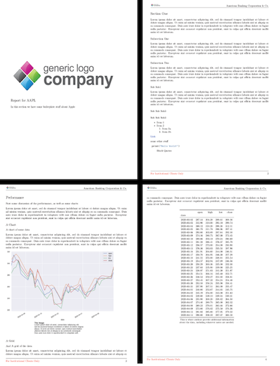

# nbconvertX
A framework for customizing NBConvert templates and building reports

## Templates
NBConvert's default templates are largely designed with academic styling. This repo is a collection of templates with industrial/business reports in mind.

## Gallery

|||
|:--|:--|
|Sample - PDF||
||[Template](nbcx/templates/reports/abc.tex.j2)|

