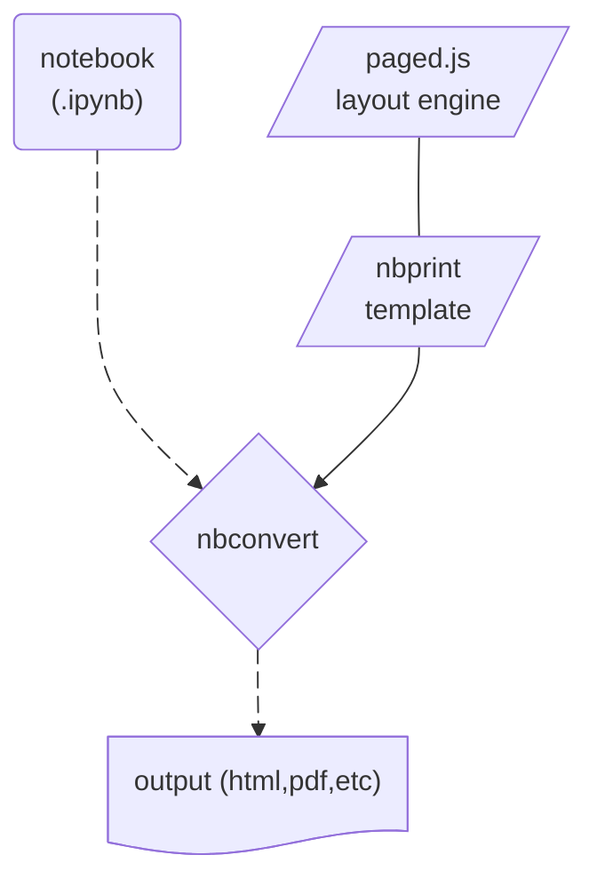
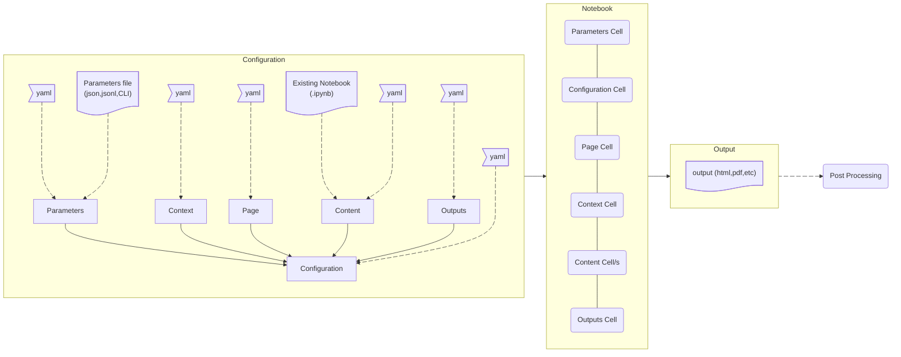

# Architecture

`nbprint` is a collection of [`pydantic`](https://docs.pydantic.dev/latest/) models to take or construct a Jupyter notebook from
a set of standard parts, execute it with [`nbconvert`](https://nbconvert.readthedocs.io/en/latest/), and convert it to `html` or `pdf`
with a standard template optionally running [`pagedjs`](https://pagedjs.org) to provide a print-oriented layout.

It can be run off an existing notebook, or using the provided [YAML-based configuration framework](./configuration.md).


```mermaid
graph TB
    nb("notebook<br>(.ipynb)")
    nbc{nbconvert}
    nbct[/nbprint <br> template/]
    pjs[/paged.js <br> layout engine/]
    o@{ shape: doc, label: "output (html,pdf,etc)" }

    nb e2@--->nbc
    e2@{animate: true}

    nbct --> nbc
    pjs --- nbct

    nbc e3@-->o
    e3@{animate: true}
```

## Components

`nbprint` provides a core `Configuration` object with parameters for controlling:

- `Parameters`: input parameters (like [papermill](https://github.com/nteract/papermill))
- `Outputs`: output assets, generally using `nbconvert` to create an `html` or `pdf` document
- `Page`: print-media specific page elements, like header/footer, page numbers, etc
- `Context`: a shared object instantiated in our notebook and passed to every content cell.
  This allows us to represent notebook "state" as a typed `pydantic` model.
- `Content`: a structured object representing the actual cells in our notebook

### `Configuration`


```mermaid
graph LR
    subgraph Configuration
    pfile@{ shape: doc, label: "Parameters file<br>(json,jsonl,CLI)" }
    paramyaml>yaml]
    param["Parameters"]
    configyaml> yaml]
    config["Configuration"]
    ctxyaml>yaml]
    ctx["Context"]
    pageyaml>yaml]
    page["Page"]
    cntyaml>yaml]
    cnt["Content"]
    nb@{ shape: doc, label: "Existing Notebook<br>(.ipynb)" }
    outyaml>yaml]
    out["Outputs"]
    end

    subgraph Notebook
    pcell(Parameters Cell)
    configcell(Configuration Cell)
    pagecell(Page Cell)
    ctxcell(Context Cell)
    contentcell("Content Cell/s")
    outputcell(Outputs Cell)
    end

    paramyaml eparamyamlparam@---> param
    eparamyamlparam@{animate: true}
    pfile epfileparam@--->param
    epfileparam@{animate: true}
    param --> config

    ctxyaml ectxyamlctx@---> ctx
    ectxyamlctx@{animate: true}
    ctx --> config

    pageyaml epageyamlpage@---> page
    epageyamlpage@{animate: true}
    page --> config

    nb enbcnt@--->cnt
    enbcnt@{animate: true}
    cntyaml ecntyamlcnt@---> cnt
    ecntyamlcnt@{animate: true}
    cnt --> config

    outyaml eoutyamlout@---> out
    eoutyamlout@{animate: true}
    out --> config

    configyaml econfigyamlconfig@---> config
    econfigyamlconfig@{animate: true}

    pcell---configcell
    configcell---pagecell
    pagecell---ctxcell
    ctxcell---contentcell
    contentcell --- outputcell

    subgraph Output
    o@{ shape: doc, label: "output (html,pdf,etc)" }
    end

    post(Post Processing)

    Configuration --> Notebook
    Notebook --> Output
    Output eOutputPosProcessing@---> post
    eOutputPosProcessing@{animate: true}

```

### `Parameters`

Parameters are the first cell of a notebook, and can be passed in during execution to allow for parameterized notebooks.

We provide the following builtin versions:

#### `PapermillParameters`

> `hydra` config: `nbprint/parameters/papermill`

This is a basic object that takes any basic json-serializeable type and provides it in assignment as the first cell.

As an example, the following `YAML`:

```yaml
# @package nbprint.parameters
_target_: nbprint.PapermillParameters
a: abc
b: 1.2
c: true
```

Would result in the following cell:

```python
a = "abc"
b = 1.2
c = True
```

### `Page`

### `Context`

Context is used to wrap variables local to the notebook.
The best documentation is a simple example in YAML form:

```yaml
---
_target_: nbprint.Configuration
context:
  _target_: nbprint.example.ExampleContext
content:
  - _target_: nbprint.ContentCode
    content: |
      nbprint_ctx.string = string
  - _target_: nbprint.ContentCode
    content: |
      print(nbprint_ctx.string)
```

This will create two `ContentCode` instances, where one sets a value `string` on the `ExampleContext` instance and the other reads it.

You can of course rely on notebook-global variables, but relying on typed contexts makes it easier to build modular reports.

### `Content`

`Content` is the basic form of displayable content.
It can be used to wrap any generic functionality or Markdown content.
It can also be convenient to reuse display configuration.

Content has a few key attributes:

- `Content.content`: string text content, or a `list[Content]` of subcontent for layout elements
- `Content.style`: A `Style` element based on CSS for styling this content
- `css`: Generic string content to be injected into a `<style>` tag scoped to this cell
- `esm`: Generic string content to be injected into a `<script>` tag scoped to this cell. It is expected to contain a function `render(cell_nbprint_metadata_as_json, cell_dom_element)`. The function may be `async` — the render lifecycle (below) awaits it before Paged.js runs.

#### Render lifecycle

Every cell with an `esm` string is wrapped in a `<script type="module">` that listens for the global `nbprint-ready` event, then invokes the cell's `render(meta, elem)` function. To guarantee pagination only starts after every cell has finished mutating the DOM, `nbprint` coordinates renders through a small lifecycle API on the global `NBPrint` instance (`window._n`).

Phases, in order:

1. **`DOMContentLoaded`** — `embedded.js` creates the `NBPrint` singleton and waits for every `` to finish decoding (so measurements see correct `naturalWidth` / `naturalHeight`).
1. **`nbprint.process()`** — reparents elements by `data-nbprint-parent-id`, hoists non-`@scope` styles to `<head>`, and runs the pre-pagination preprocessor.
1. **`nbprint-ready` event dispatched** — every cell's ESM listener runs *synchronously* (the `CustomEvent` dispatch is synchronous), and inside its listener each cell calls `nbp.trackRender(async () => render(meta, elem))`. The registered promise is retained by the lifecycle.
1. **Barrier: `nbp.waitForRenders()`** — awaits every tracked promise. If a render schedules further renders, the barrier loops until a tick passes with no new registrations, so cascading async work (e.g. dynamic imports, sub-renders) all settles. A rejection in one cell is logged and isolated; it does not block other cells.
1. **`nbprint-esm-complete` event dispatched** — signals "DOM is stable, pagination starts now". Use this instead of `nbprint-ready` for any code that wants to run after user-land renders are done (diagnostics, measure-phase tweaks, future overflow detection).
1. **`nbprint.build()`** — hands off to Paged.js. By this point the DOM is final.
1. **`nbprint.postprocess()`** — dispatches `nbprint-done`.

**Writing a cell `render()` function.** The template handles registration automatically; author your ESM as if it were stand-alone:

```javascript
// esm string on a Content model
export function render(meta, elem) {
    // synchronous render
    elem.querySelector(".my-chart").style.opacity = "1";
}

// async is fine — the lifecycle awaits the promise
export async function render(meta, elem) {
    const data = await fetch(meta.data_url).then((r) => r.json());
    renderChart(elem, data);
}
```

Key guarantees:

- **Isolation.** One cell's failure never blocks pagination of the rest of the document; the error is logged to the console with `[nbprint] cell render failed:` and the rejected promise resolves.
- **Order independence.** `render()` calls run concurrently; do not rely on cell execution order. If you need cross-cell coordination, use the Phase 7 `Context` mechanism (typed, ordered, Python-side) rather than ad-hoc JS globals.
- **Late registration is legal but not useful.** Calling `trackRender()` after `nbprint-esm-complete` has already fired produces a console warning and returns the promise ungated; pagedjs will not wait for it.
- **Standalone fallback.** When the template is rendered outside the normal embedded pipeline (stand-alone fixtures, structural tests), the cell script falls back to fire-and-forget invocation — `trackRender` is optional.

#### `ContentCode`

Content that is executed as a code cell.

#### `ContentMarkdown`

Content that is executed as a Markdown cell.

#### `ContentImage`

#### `ContentTableOfContents`

#### Layout Elements

- `ContentLayout`
- `ContentInlineLayout`
- `ContentFlexColumnLayout`
- `ContentFlexRowLayout`
- `ContentPageBreak`

#### Page-box primitives

The page-box primitives (Phase 9.1 / 9.3) are first-class `Content`
models for WYSIWYG, page-level authoring. Both are plain pydantic
classes so every field is reachable from a hydra/lerna CLI override
such as `+nbprint.content.middlematter[3].fit=strict`.

##### `ContentPageBox`

A single logical page. Always emits at least one page (even when
empty), forces a `break-before` and `break-after`, and exposes
per-page overrides for `page_size`, `page_orientation`, and
`page_margins`. Children flow inside it as page-blocks; overflow
spills onto additional pages without dropping content.

Key fields: `fit` (`scale` / `shrink` / `strict` / `none`),
`min_pages`, `page_size`, `page_orientation`, `page_margins`,
`layout`, `gap`, `padding`, `align`, `justify`. Emits
`data-nbprint-page-box`, `data-nbprint-fit`,
`data-nbprint-layout`, and (when overridden)
`data-nbprint-min-pages` for downstream JS measurement and CSS
targeting.

###### Layout presets

`ContentPageBox.layout` selects a built-in arrangement for child
blocks. Each preset emits the corresponding CSS on `:scope`; they
share constants with the existing flex/inline layout containers so
there is one source of truth for "what does `display: flex` mean."

| `layout`      | CSS emitted                                                                     | Use for                              |
| ------------- | ------------------------------------------------------------------------------- | ------------------------------------ |
| `flow`        | normal block flow (`gap` → `margin-top` between siblings)                       | default — long-form content          |
| `columns-2/3` | `column-count: N; column-fill: balance`                                         | newspaper-style multi-column layouts |
| `grid-2x2`    | `display: grid; grid-template-columns: repeat(2, 1fr)`                          | 4-cell dashboards                    |
| `grid-3x2`    | `display: grid; grid-template-columns: repeat(3, 1fr)`                          | 6-cell dashboards                    |
| `grid-3x3`    | `display: grid; grid-template-columns: repeat(3, 1fr)`                          | 9-cell mosaics                       |
| `grid`        | bare `display: grid` for named-area templates (Phase 9.5)                       | custom grids with `grid_template`    |
| `flex-row`    | `display: flex; flex-direction: row` (shared with `ContentFlexRowLayout`)       | side-by-side panels                  |
| `flex-column` | `display: flex; flex-direction: column` (shared with `ContentFlexColumnLayout`) | stacked panels with gap              |
| `inline`      | `display: block` + per-sibling `margin-left` for `gap`                          | header/badge rows                    |
| `masonry`     | `display: grid; grid-template-rows: masonry` (+ JS polyfill, Phase 9.17)        | tile galleries                       |
| `custom`      | suppresses preset CSS — user owns `:scope` via `css`                            | full manual control                  |

`gap`, `padding`, `align`, `justify` are passed to whichever preset
makes sense for them; they are no-ops for presets that don't apply
(e.g. `align` on `flow`).

Crucially, the page-box runs an **auto-wrap validator**: any bare
child `Content` inside its `content` list is wrapped in a
`ContentPageBlock` so the DOM shape is always
`page-box > block > <user content>`. Authors who want to escape
auto-placement (e.g. "this hero spans both columns") write the
block explicitly.

```yaml
content:
  middlematter:
    - type_: nbprint.ContentPageBox
      layout: grid-2x2
      gap: 0.25in
      content:
        # auto-wrapped — no explicit ContentPageBlock needed
        - type_: nbprint.ContentMarkdown
          content: "## Quarter highlights"
        - type_: nbprint.ContentImage
          src: revenue.png
        # explicit block to span both columns
        - type_: nbprint.ContentPageBlock
          span: 2
          content:
            - type_: nbprint.ContentImage
              src: hero.png
```

```bash
# Hydra CLI override switches a page-box from flow to a 3-column grid
nbprint examples/research.yaml \
    '+nbprint.content.middlematter[2].layout=grid-3x2' \
    '+nbprint.content.middlematter[2].gap=0.5in'
```

###### Named-area grids (`grid_template`)

When `layout="grid"`, set `grid_template` to a raw CSS
`grid-template` value to lay out children by name. Each child block
references a cell via `area=`; the page-box validator cross-checks
that every referenced area exists in the template (unused template
areas are allowed — they just produce empty cells). The `.`
placeholder is treated as an empty cell, not an area name.

```yaml
- type_: nbprint.ContentPageBox
  layout: grid
  grid_template: "'hero hero' 'chart table' / 1fr 1fr"
  gap: 0.25in
  content:
    - type_: nbprint.ContentPageBlock
      area: hero
      content: [...]
    - type_: nbprint.ContentPageBlock
      area: chart
      content: [...]
    - type_: nbprint.ContentPageBlock
      area: table
      content: [...]
```

##### `ContentPageBlock`

The atomic layout item inside a `ContentPageBox`. Defaults to
`break-inside: avoid` so each block is a "keep together" unit.
Supports grid placement (`span`, `rows`, `area`), aspect-ratio and
height constraints (`aspect`, `min_height`, `max_height`), and an
explicit `scalable` hint that the page-box's `fit` pass will respect
when shrinking content to fit.

Per-instance values are emitted both as discoverable
`data-nbprint-*` attributes (for JS measurement and CSS attribute
selectors) and as inline `style=` rules so they win over any preset
CSS from the parent page-box. User-supplied `attrs.style` is
preserved and appended after the generated rules.

```yaml
# YAML usage inside a ContentPageBox
content:
  middlematter:
    - type_: nbprint.ContentPageBox
      fit: scale
      content:
        - type_: nbprint.ContentPageBlock
          span: 2
          aspect: "16:9"
          content:
            - type_: nbprint.ContentImage
              src: hero.png
        - type_: nbprint.ContentPageBlock
          break_inside: auto       # this one is allowed to flow
          content:
            - type_: nbprint.ContentMarkdown
              content: "Long narrative text..."
```

```bash
# Hydra CLI override of a single block's span
nbprint examples/research.yaml \
    '+nbprint.content.middlematter[0].content[0].span=3' \
    '+nbprint.content.middlematter[0].content[0].aspect=1.7777'
```

##### Runtime API: `NBPrintPage` and `NBPrintBlock`

`ContentPageBox` and `ContentPageBlock` can also be authored from
inside a notebook via the matching runtime context managers, which
emit hidden `application/nbprint.page+json` /
`application/nbprint.block+json` MIME outputs. The ingestion path
extracts those payloads and routes them through the same
`type_`-aware machinery that handles YAML — there is no separate
runtime path.

```python
from IPython.display import display
from nbprint import NBPrintPage, NBPrintBlock

# A landscape dashboard page split into a hero + 2 mid + 1 footer.
with NBPrintPage(
    layout="grid",
    grid_template="'hero hero' 'chart table' 'footer footer' / 1fr 1fr",
    page_orientation="landscape",
    fit="scale",
    gap="0.25in",
):
    with NBPrintBlock(area="hero"):
        display(banner_image)
    with NBPrintBlock(area="chart", aspect="16:9"):
        display(revenue_chart)
    with NBPrintBlock(area="table", break_inside="auto"):
        display(deals_table)  # allowed to flow if it overflows
    with NBPrintBlock(area="footer"):
        display(disclaimer_md)
```

Both context managers accept every field of their corresponding
`Content` model. Outside a `ContentPageBox`, `NBPrintBlock` still
applies — `break_inside: avoid` is a useful "keep together"
primitive even in long-scroll reports.

#### Library Configuration Elements

- `LoggingConfig`
- `PandasDisplayConfiguration`
- `PlotlyRendererConfiguration`
- `SeabornDisplayConfiguration`

### `Outputs`

`nbprint` can produce a variety of outputs based on [`nbconvert`](https://nbconvert.readthedocs.io/en/latest/).
It can also postprocess these outputs based on content, to e.g. email a report if a certain cell returns `True`, as a simple example.

The following defaults are provided:

#### `Outputs`

This is the base class for all outputs.
It has a few key attributes:

- `.root`: Base path where output artifacts will generate
- `.naming`: naming convention to use for output artifacts. This is particularly useful when producing many artifacts. It is templatized via Jinja2 with the following arguments:
  - `name`: name of the notebook
  - `date`: current date as ISO format
  - `datetime`: current datetime as ISO format
  - `uuid`: a generated UUID
  - `sha`: a hash of the `Configuration` object
  - any parameters set in the `Configuration.parameters` object
- `.hook`: a python callable path to be invoked after notebook generation
- `.postprocess`: a python callable path to be invoked at the very end of the `Configuration` run/s

In particular, the hooks can be used to get behavior like: only send a report via email if XYZ condition is (not) satisfied.

#### `NBConvertOutputs`

> `hydra` config: `nbprint/outputs/default`

This `Outputs` runs `nbconvert` to produce an output document.
It supports the following configuration options:

- `target`: `nbconvert` target, in `html`, `pdf`, or `notebook`
- `execute`: whether or not to reexecute the notebook, defaults to `True`
- `timeout`: execution timeout, defaults to `600s`
- `template`: `nbconvert` template to use, defaults to `"nbprint"`

Additionally, there are two extra hooks that can be set:

- `execute_hook`: Called after `nbconvert` execution of the notebook
- `nbconvert_hook`: Called after `nbconvert` conversion of the notebook

#### `PDFOutputs`

> `hydra` config: `nbprint/outputs/pdf`

Same as `NBConvertOutputs`, but with `target=pdf`.

#### `NotebookOutputs`

> `hydra` config: `nbprint/outputs/notebook`

Same as `NBConvertOutputs`, but with `target=notebook`.

#### `HTMLOutputs`

> `hydra` config: `nbprint/outputs/html`

Same as `NBConvertOutputs`, but with `target=html`.

#### `WebHTMLOutputs`

> `hydra` config: `nbprint/outputs/webhtml`

Same as `NBConvertOutputs`, but with `target=webhtml`.

#### `NBConvertShortCircuitOutputs`

A specialized `NBConvertOutputs` that stops output processing if a cell tagged `nbprint:output:stop` returns `True`

- `execute_hook`: A Python import path to a function to evaluate, see `nbprint.config.outputs.nbconvert.short_circuit_hook` as an example

#### `EmailOutputs`

> `hydra` config: `nbprint/outputs/email`

Inherits from `NBConvertOutputs` and attaches the output to an email using a prebuilt `postprocess` hook.

- `body`: Content of the email, defaults to the output name
- `subject`: Content of the subject, defaults to the output name
- `to`: Email recipient/s
- `from_`: Email sender
- `cc`: CC
- `bcc`: BCC
- `smtp`: SMTP configuration
  - `host`: SMTP server host
  - `port`: SMTP server port
  - `user`: SMTP server user
  - `password`: SMTP server password
  - `tls`: Enable TLS
  - `ssl`: Enable SSL
  - `timeout`: Timeout for SMTP connection

## Configuration

[`hydra`](https://hydra.cc) allows us the ability to mix and match the various components defined in YAML, or even build our own.
Its easy for us to mix-and-match configuration for content, outputs, layout, and more.
It also lets us tweak existing `pydantic`-defined options from the command line.

Let's look at some examples of how powerful this can be:

In this command, we run a default `nbprint.Configuration` but use content from an existing notebook.

```bash
# Create HTML from notebook as-is
nbprint examples/basic.ipynb
```

In this command, we tweak the `nbprint.Configuration` object's `.name` attribute to be `"test"`, and we tweak the `nbprint.Configuration` object's `outputs` subobject's `.target` attribute to be `"pdf"`.

```bash
nbprint examples/basic.ipynb +nbprint.name=test ++nbprint.outputs.target=pdf

```

In this command, we tweak the `nbprint.Configuration` object's `parameters` subobject to add a new key `"a"` with value `"test"`.
This will inject the following first cell into our notebook:

```bash
# First cell is papermill-style parameters
nbprint examples/parameters.ipynb +nbprint.parameters.a=test
```

```python
a = "test"
```

This allows us to integrate nicely with [papermill](https://github.com/nteract/papermill) notebooks, and build parameterized reports to produce different outputs from the same skeleton notebook.

In this command, we take an existing notebook content and inject some content as frontmatter.

```bash
# Overlay a config group, e.g. title and table of contents
nbprint examples/basic.ipynb nbprint/content/frontmatter=nbprint/title_toc
```

In particular, we grab the code defined in `nbprint/config/hydra/content/frontmatter/nbprint/title_toc.yaml`:

```yaml
# @package nbprint.content.frontmatter
- _target_:  nbprint.ContentMarkdown
  content: |
    # ${nbprint.name}
  css: ":scope { text-align: center; }"
- _target_:  nbprint.ContentPageBreak
- _target_:  nbprint.ContentTableOfContents
- _target_:  nbprint.ContentPageBreak
```

Similar to the previous command, this command swaps `nbprint.Configuration` object's `outputs` subobject to be the
object defined in `nbprint/config/hydra/outputs/nbprint/pdf.yaml`:

```bash
# Create PDF via WebPDF by using hydra to swap out outputs type
nbprint examples/basic.ipynb nbprint/outputs=nbprint/pdf
```

That content just defines a different `nbprint.Outputs` object in `YAML`:

```yaml
# @package nbprint.outputs
_target_: nbprint.PDFOutputs
target: webpdf
```

Finally, we could accomplish the same thing by tweaking the default `Outputs` object's `.target` attribute to be `webpdf`.

```bash
# Create PDF via WebPDF same as above by using hydra to tweak the default output target
nbprint examples/basic.ipynb ++nbprint.outputs.target=webpdf
```

By providing the ability to do deep dependency injection in existing objects and/or swap objects wholesale,
we can customize, tweak, and extend `nbprint` as much as we need.
