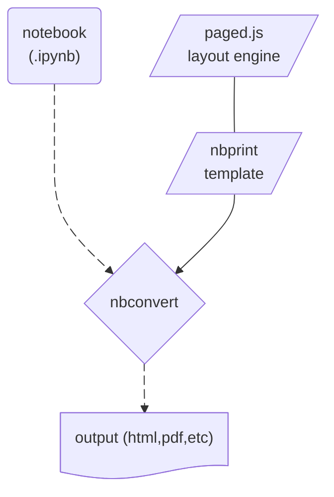
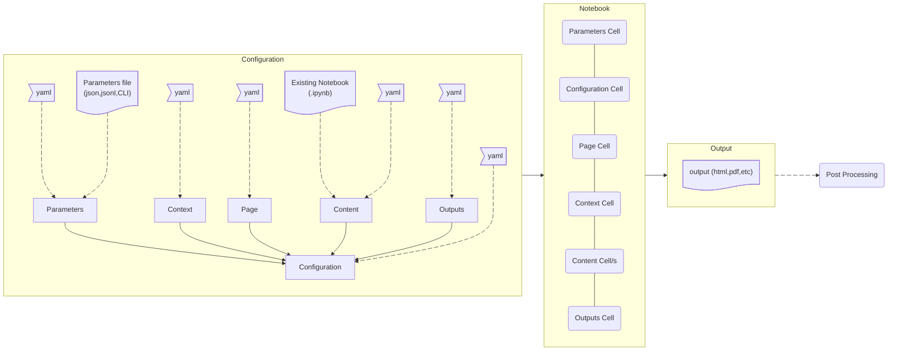

# Architecture

`nbprint` is a collection of [`pydantic`](https://docs.pydantic.dev/latest/) models to take or construct a Jupyter notebook from
a set of standard parts, execute it with [`nbconvert`](https://nbconvert.readthedocs.io/en/latest/), and convert it to `html` or `pdf`
with a standard template optionally running [`pagedjs`](https://pagedjs.org) to provide a print-oriented layout.

It can be run off an existing notebook, or using the provided [YAML-based configuration framework](./configuration.md).



## Components

`nbprint` provides a core `Configuration` object with parameters for controlling:

- `Parameters`: input parameters (like [papermill](https://github.com/nteract/papermill))
- `Outputs`: output assets, generally using `nbconvert` to create an `html` or `pdf` document
- `Page`: print-media specific page elements, like header/footer, page numbers, etc
- `Context`: a shared object instantiated in our notebook and passed to every content cell.
  This allows us to represent notebook "state" as a typed `pydantic` model.
- `Content`: a structured object representing the actual cells in our notebook

### `Configuration`



### `Parameters`

Parameters are the first cell of a notebook, and can be passed in during execution to allow for parameterized notebooks.

We provide the following builtin versions:

#### `PapermillParameters`

> `hydra` config: `nbprint/parameters/papermill`

This is a basic object that takes any basic json-serializeable type and provides it in assignment as the first cell.

As an example, the following `YAML`:

```yaml
# @package nbprint.parameters
_target_: nbprint.PapermillParameterss
a: abc
b: 1.2
c: true
```

Would result in the following cell:

```python
a = "abc"
b = 1.2
c = True
```

### `Page`

### `Context`

Context is used to wrap variables local to the notebook.
The best documentation is a simple example in YAML form:

```yaml
---
_target_: nbprint.Configuration
context:
  _target_: nbprint.example.ExampleContext
content:
  - _target_: nbprint.ContentCode
    content: |
      nbprint_ctx.string = string
  - _target_: nbprint.ContentCode
    content: |
      print(nbprint_ctx.string)
```

This will create two `ContentCode` instances, where one sets a value `string` on the `ExampleContext` instance and the other reads it.

You can of course rely on notebook-global variables, but relying on typed contexts makes it easier to build modular reports.

### `Content`

`Content` is the basic form of displayable content.
It can be used to wrap any generic functionality or Markdown content.
It can also be convenient to reuse display configuration.

Content has a few key attributes:

- `Content.content`: string text content, or a `list[Content]` of subcontent for layout elements
- `Content.style`: A `Style` element based on CSS for styling this content
- `css`: Generic string content to be injected into a `<style>` tag scoped to this cell
- `esm`: Generic string content to be injected into a `<script>` tag scoped to this cell. It is expected to contain a function `render(cell_nbprint_metadata_as_json, cell_dom_element)`.

The following items are provided:

#### `ContentCode`

Content that is executed as a code cell.

#### `ContentMarkdown`

Content that is executed as a Markdown cell.

#### `ContentImage`

#### `ContentTableOfContents`

#### Layout Elements

- `ContentLayout`
- `ContentInlineLayout`
- `ContentFlexColumnLayout`
- `ContentFlexRowLayout`
- `ContentPageBreak`

#### Library Configuration Elements

- `LoggingConfig`
- `PandasDisplayConfiguration`
- `PlotlyRendererConfiguration`
- `SeabornDisplayConfiguration`

### `Outputs`

`nbprint` can produce a variety of outputs based on [`nbconvert`](https://nbconvert.readthedocs.io/en/latest/).
It can also postprocess these outputs based on content, to e.g. email a report if a certain cell returns `True`, as a simple example.

The following defaults are provided:

#### `Outputs`

This is the base class for all outputs.
It has a few key attributes:

- `.root`: Base path where output artifacts will generate
- `.naming`: naming convention to use for output artifacts. This is particularly useful when producing many artifacts. It is templatized via Jinja2 with the following arguments:
  - `name`: name of the notebook
  - `date`: current date as ISO format
  - `datetime`: current datetime as ISO format
  - `uuid`: a generated UUID
  - `sha`: a hash of the `Configuration` object
  - any parameters set in the `Configuration.parameters` object
- `.hook`: a python callable path to be invoked after notebook generation
- `.postprocess`: a python callable path to be invoked at the very end of the `Configuration` run/s

In particular, the hooks can be used to get behavior like: only send a report via email if XYZ condition is (not) satisfied.

#### `NBConvertOutputs`

> `hydra` config: `nbprint/outputs/default`

This `Outputs` runs `nbconvert` to produce an output document.
It supports the following configuration options:

- `target`: `nbconvert` target, in `html`, `pdf`, or `notebook`
- `execute`: whether or not to reexecute the notebook, defaults to `True`
- `timeout`: execution timeout, defaults to `600s`
- `template`: `nbconvert` template to use, defaults to `"nbprint"`

Additionally, there are two extra hooks that can be set:

- `execute_hook`: Called after `nbconvert` execution of the notebook
- `nbconvert_hook`: Called after `nbconvert` conversion of the notebook

#### `PDFOutputs`

> `hydra` config: `nbprint/outputs/pdf`

Same as `NBConvertOutputs`, but with `target=pdf`.

#### `NotebookOutputs`

> `hydra` config: `nbprint/outputs/notebook`

Same as `NBConvertOutputs`, but with `target=notebook`.

#### `HTMLOutputs`

> `hydra` config: `nbprint/outputs/html`

Same as `NBConvertOutputs`, but with `target=html`.

#### `WebHTMLOutputs`

> `hydra` config: `nbprint/outputs/webhtml`

Same as `NBConvertOutputs`, but with `target=webhtml`.

#### `NBConvertShortCircuitOutputs`

A specialized `NBConvertOutputs` that stops output processing if a cell tagged `nbprint:output:stop` returns `True`

- `execute_hook`: A Python import path to a function to evaluate, see `nbprint.config.outputs.nbconvert.short_circuit_hook` as an example

#### `EmailOutputs`

> `hydra` config: `nbprint/outputs/email`

Inherits from `NBConvertOutputs` and attaches the output to an email using a prebuilt `postprocess` hook.

- `body`: Content of the email, defaults to the output name
- `subject`: Content of the subject, defaults to the output name
- `to`: Email recipient/s
- `from_`: Email sender
- `cc`: CC
- `bcc`: BCC
- `smtp`: SMTP configuration
  - `host`: SMTP server host
  - `port`: SMTP server port
  - `user`: SMTP server user
  - `password`: SMTP server password
  - `tls`: Enable TLS
  - `ssl`: Enable SSL
  - `timeout`: Timeout for SMTP connection

## Configuration

[`hydra`](https://hydra.cc) allows us the ability to mix and match the various components defined in YAML, or even build our own.
Its easy for us to mix-and-match configuration for content, outputs, layout, and more.
It also lets us tweak existing `pydantic`-defined options from the command line.

Let's look at some examples of how powerful this can be:

In this command, we run a default `nbprint.Configuration` but use content from an existing notebook.

```bash
# Create HTML from notebook as-is
nbprint examples/basic.ipynb
```

In this command, we tweak the `nbprint.Configuration` object's `.name` attribute to be `"test"`, and we tweak the `nbprint.Configuration` object's `outputs` subobject's `.target` attribute to be `"pdf"`.

```bash
nbprint examples/basic.ipynb +nbprint.name=test ++nbprint.outputs.target=pdf

```

In this command, we tweak the `nbprint.Configuration` object's `parameters` subobject to add a new key `"a"` with value `"test"`.
This will inject the following first cell into our notebook:

```bash
# First cell is papermill-style parameters
nbprint examples/parameters.ipynb +nbprint.parameters.a=test
```

```python
a = "test"
```

This allows us to integrate nicely with [papermill](https://github.com/nteract/papermill) notebooks, and build parameterized reports to produce different outputs from the same skeleton notebook.

In this command, we take an existing notebook content and inject some content as frontmatter.

```bash
# Overlay a config group, e.g. title and table of contents
nbprint examples/basic.ipynb nbprint/content/frontmatter=nbprint/title_toc
```

In particular, we grab the code defined in `nbprint/config/hydra/content/frontmatter/nbprint/title_toc.yaml`:

```yaml
# @package nbprint.content.frontmatter
- _target_:  nbprint.ContentMarkdown
  content: |
    # ${nbprint.name}
  css: ":scope { text-align: center; }"
- _target_:  nbprint.ContentPageBreak
- _target_:  nbprint.ContentTableOfContents
- _target_:  nbprint.ContentPageBreak
```

Similar to the previous command, this command swaps `nbprint.Configuration` object's `outputs` subobject to be the
object defined in `nbprint/config/hydra/outputs/nbprint/pdf.yaml`:

```bash
# Create PDF via WebPDF by using hydra to swap out outputs type
nbprint examples/basic.ipynb nbprint/outputs=nbprint/pdf
```

That content just defines a different `nbprint.Outputs` object in `YAML`:

```yaml
# @package nbprint.outputs
_target_: nbprint.PDFOutputs
target: webpdf
```

Finally, we could accomplish the same thing by tweaking the default `Outputs` object's `.target` attribute to be `webpdf`.

```bash
# Create PDF via WebPDF same as above by using hydra to tweak the default output target
nbprint examples/basic.ipynb ++nbprint.outputs.target=webpdf
```

By providing the ability to do deep dependency injection in existing objects and/or swap objects wholesale,
we can customize, tweak, and extend `nbprint` as much as we need.
