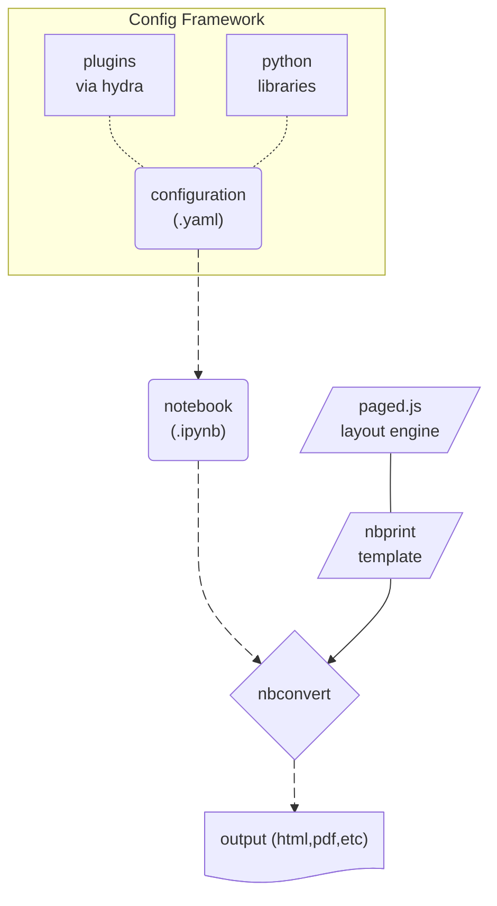
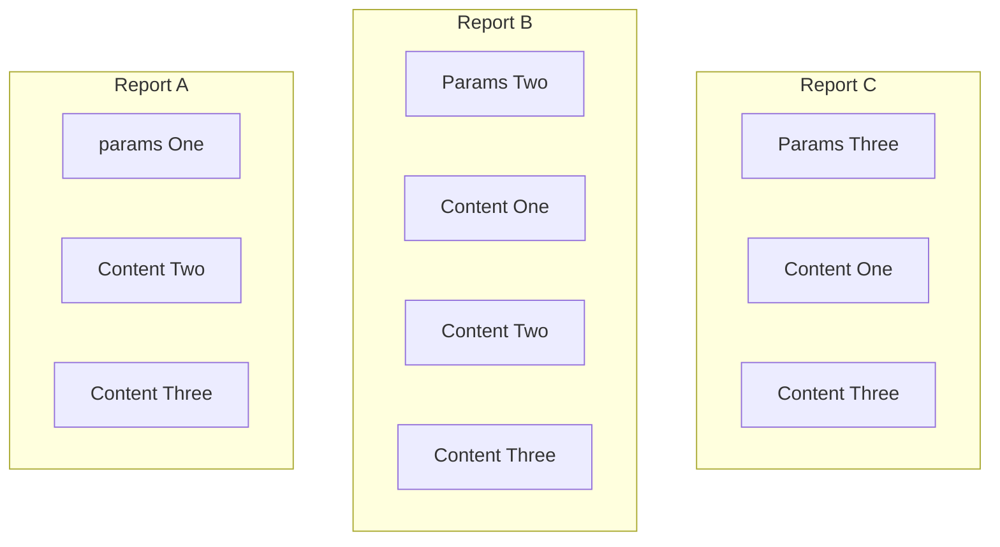

# Configuration

`nbprint` can be used purely via notebook metadata, but it also provides a `yaml`-based framework for configuration (via [`pydantic`](https://docs.pydantic.dev/latest/), [`hydra`](https://hydra.cc), and [`omegaconf`](https://github.com/omry/omegaconf)).
This is particularly convenient when generating parameterized or componentized reports.



For example, imagine I had a collection of models that I wanted to evaluate for different hyperparameters, where models might have overlapping sets of report elements I want to see.
With `nbprint`'s configuration system, this is easy to compose.



This configuration also allows for easier iteration on a report's design and content.

## YAML-based Reports

Let's take a simple placeholder report.

```yaml
---
debug: false
outputs:
  _target_: nbprint:NBConvertOutputs
  path_root: ./outputs
  target: html

content:
  - _target_: nbprint:ContentMarkdown
    content: |
      # A Generic Report
      ## A Subtitle
    css: ":scope { text-align: center; }"

  - _target_: nbprint:ContentPageBreak

  - _target_: nbprint:ContentTableOfContents

  - _target_: nbprint:ContentPageBreak

  - _target_: nbprint:ContentMarkdown
    content: |
      # Section One
      Lorem ipsum dolor sit amet.
      ## Subsection One
      Consectetur adipiscing elit, sed do eiusmod tempor incididunt.
      ## Subsection Two
      Ut labore et dolore magna aliqua.

  - _target_: nbprint:ContentPageBreak

  - _target_: nbprint:ContentFlexRowLayout
    sizes: [1, 1]
    content:
      - _target_: nbprint:ContentFlexColumnLayout
        content:
          - _target_: nbprint:ContentMarkdown
            content: |
              # Section Two
              Lorem ipsum dolor sit amet.
              ## Subsection One
              Consectetur adipiscing elit, sed do eiusmod tempor incididunt.

      - _target_: nbprint:ContentFlexColumnLayout
        content:
          - _target_: nbprint:ContentMarkdown
            content: |
              # Section Three
              Ut labore et dolore magna aliqua.
              ## Subsection One
              Ut enim ad minim veniam, quis nostrud.
```

Let's break this down step by step.

First, we configure `debug: false`. This tells `nbprint` to run `pagedjs` print preview. We also set the output to run `nbconvert` and configure the folder for outputs to be placed.

Next we fill in some content. Here we use a few components:

- `ContentMarkdown` to generate Markdown cells
- `ContentPageBreak` to split onto a new page in our pdf
- `ContentTableOfContents` to create a table of contents. Note that this will work in both html preview, and pdf form!
- `ContentFlexRowLayout` and `ContentFlexColumnLayout` to create some layout structure for our document.

## Run

We can now generate the report by running the CLI:

```bash
nbprint examples/basic.yaml
```

This will create a Notebook output in our specified folder `examples/output`, as well as an html asset (since that is what we specified in the yaml file). Both will have the date as a suffix, which is also configurable in our yaml. We see the generated report notebook, which we can open and use for further experimentation or to investigate the report itself.

</a>

We also see the html document itself, which will be rendered via [`pagedjs`](https://pagedjs.org) print preview.

</a>

You can find a pdf form of this document [here](https://github.com/nbprint/nbprint/raw/main/docs/img/example-basic.pdf?raw=true).

## ccflow integration

`nbprint` is compatible with [ccflow](https://github.com/point72/ccflow) callable models.
`nbprint` outputs like `NBConvertOutputs` inherit from [`ccflow.ResultsBase`](https://github.com/Point72/ccflow/wiki/Workflows#result-type), and `nbprint` parameters like `Parameters` inherit from [`ccflow.ContextBase`](https://github.com/Point72/ccflow/wiki/Workflows#context).

```bash
nbprint-cc +nbprint.name=test +context=[]
```

## Workflows

We also support [ccflow workflows](https://github.com/point72/ccflow/wiki/Workflows) in the form of multi-runs:

```bash
nbprint \
  examples/basic.ipynb \
  ++callable=/nbprintx \ # Switch to the multirun model
  +nbprint.outputs.naming='\{\{name\}\}-\{\{date\}\}-\{\{a\}\}' \ # Update the output naming convention to include the param
  +nbprintx.parameters=[{"a":1},{"a":2},{"a":3}] \ # Pass in JSON or filepath
  ++nbprint.outputs.execute=False # Turn off execution for demo speed
```
