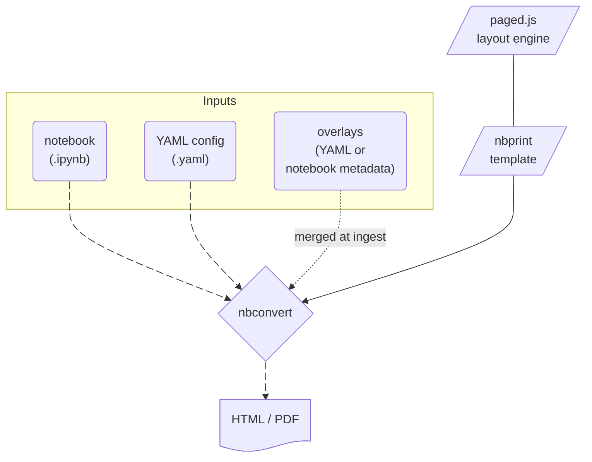

# Configuration

`nbprint` supports three complementary ways to configure a report:

1. **Notebook-first** — point nbprint at an existing `.ipynb` and drive sectioning, styling, and page layout from cell tags, cell metadata, and a small `%%nbprint` magic.
1. **YAML-first** — describe the full document in YAML (via [`pydantic`](https://docs.pydantic.dev/latest/) models, composed with [`lerna`](https://github.com/nbprint/lerna) and [`omegaconf`](https://github.com/omry/omegaconf)).
1. **Hybrid** — start from a notebook and add YAML overlays that target cells by index, tag, section, or cell type without rewriting the notebook.


```mermaid
graph TB
    subgraph Inputs
        nb("notebook<br>(.ipynb)")
        yml("YAML config<br>(.yaml)")
        ovl("overlays<br>(YAML or<br>notebook metadata)")
    end

    nbct[/nbprint<br>template/]
    pjs[/paged.js<br>layout engine/]
    nbc{nbconvert}
    o@{ shape: doc, label: "HTML / PDF" }

    nb e1@-->nbc
    yml e2@-->nbc
    ovl -.->|merged at ingest| nbc
    nbct --> nbc
    pjs --- nbct
    nbc e3@--> o
    e1@{animate: true}
    e2@{animate: true}
    e3@{animate: true}
```

## Notebook-First Workflow

Point nbprint at a `.ipynb` and it is treated as a full configuration input. All notebook metadata under `notebook.metadata.nbprint` becomes configuration; cell metadata and tags drive routing, styling, and visibility.

```bash
nbprint path/to/report.ipynb
```

Worked examples live in [`examples/`](../../examples):

- [`notebook-sections.ipynb`](../../examples/notebook-sections.ipynb) — section routing via tags and cell metadata, with page/output config in notebook metadata.
- [`notebook-runtime.ipynb`](../../examples/notebook-runtime.ipynb) — runtime API (`NBPrintCell`) and `%%nbprint` magic.
- [`notebook-overlays.ipynb`](../../examples/notebook-overlays.ipynb) — `overlays` and `layout_overlays` embedded in notebook metadata.

### Section routing from cell tags

By default every ingested cell lands in `middlematter`. To route cells to named sections, tag them:

```jsonc
// cell.metadata
{
  "tags": ["nbprint:section:covermatter"]
}
```

The tag form is `nbprint:section:<name>` where `<name>` is any of the 13 section names (see [Structured Sections](#structured-sections) below).

### Section routing from cell metadata

Equivalent to a tag, but takes priority:

```jsonc
// cell.metadata.nbprint
{
  "section": "frontmatter"
}
```

### Notebook-level page and output config

Embed a full page/output spec directly in the notebook — no YAML required:

```jsonc
// notebook.metadata.nbprint
{
  "page": {
    "_target_": "nbprint.PageGlobal",
    "size": "Letter",
    "orientation": "portrait"
  },
  "outputs": {
    "_target_": "nbprint.NBConvertOutputs",
    "target": "pdf"
  }
}
```

YAML or CLI overrides always take precedence over notebook-embedded values, so you can use a notebook's defaults and override on the command line.

### `NBPrintCell` runtime API

Inside a running notebook you can express cell-level intent through a Python object. Metadata is persisted via a hidden `display()` output with a custom MIME type; nbprint picks it up at ingestion time.

```python
from nbprint import NBPrintCell, Style, Font

NBPrintCell(section="covermatter", css=":scope { text-align: center; }")

with NBPrintCell(style=Style(font=Font(size=24))):
    display(Markdown("# Cover Page"))
```

### `%%nbprint` cell magic

A lighter alternative for quick one-liners:

```python
%%nbprint section=frontmatter css=":scope { font-size: 18px; }"
display(Markdown("# Introduction"))
```

Explicit cell metadata beats runtime metadata beats magic — so a hand-edited value in `cell.metadata.nbprint` always wins.

## YAML-First Workflow

YAML is the most expressive way to describe a report: every field of every pydantic model is reachable, and the lerna config system makes it easy to share pieces across reports.

A minimal example:

```yaml
---
debug: false
outputs:
  _target_: nbprint.NBConvertOutputs
  root: ./outputs
  target: html

content:
  - _target_: nbprint.ContentMarkdown
    content: |
      # A Generic Report
      ## A Subtitle
    css: ":scope { text-align: center; }"

  - _target_: nbprint.ContentPageBreak
  - _target_: nbprint.ContentTableOfContents
  - _target_: nbprint.ContentPageBreak

  - _target_: nbprint.ContentFlexRowLayout
    sizes: [1, 1]
    content:
      - _target_: nbprint.ContentFlexColumnLayout
        content:
          - _target_: nbprint.ContentMarkdown
            content: "# Left column"
      - _target_: nbprint.ContentFlexColumnLayout
        content:
          - _target_: nbprint.ContentMarkdown
            content: "# Right column"
```

Run it:

```bash
nbprint examples/basic.yaml
```

Common content types include `ContentMarkdown`, `ContentCode`, `ContentPageBreak`, `ContentTableOfContents`, and the layout containers `ContentFlexRowLayout` / `ContentFlexColumnLayout` / `ContentInlineLayout`.

## Structured Sections

For book-style documents, `nbprint` supports 13 ordered sections grouped into 6 logical groups:

| Group        | Sections                                                               | Description                                        |
| ------------ | ---------------------------------------------------------------------- | -------------------------------------------------- |
| Prematter    | `prematter`                                                            | Hidden content executed before report construction |
| Covermatter  | `covermatter`                                                          | Cover page content                                 |
| Frontmatter  | `title`, `copyright`, `dedication`, `table_of_contents`, `frontmatter` | Title page, legal, dedication, TOC, preface        |
| Middlematter | `middlematter`, `middlematter_separators`                              | Main body and chapter dividers                     |
| Endmatter    | `appendix`, `index`, `endmatter`                                       | Supplementary material, index, bibliography        |
| Rearmatter   | `rearmatter`                                                           | Back cover content                                 |

Instead of a flat list, `content:` can be keyed by section name. Sections are rendered in document order; unused sections are simply empty.

```yaml
content:
  covermatter:
    - _target_: nbprint.ContentMarkdown
      content: "# My Report"
      css: ":scope { text-align: center; }"

  table_of_contents:
    - _target_: nbprint.ContentTableOfContents

  middlematter:
    - _target_: nbprint.ContentMarkdown
      content: "# Section One"

  endmatter:
    - _target_: nbprint.ContentMarkdown
      content: "# Bibliography"
```

Flat-list `content:` is still fully supported — it is treated as `middlematter`.

### Per-section page layout

Each section can carry its own page layout via `PageGlobal.pages`. This generates CSS `@page <section> { ... }` rules and maps cells to them via `data-nbprint-section` attributes:

```yaml
page:
  _target_: nbprint.PageGlobal
  bottom_right:
    _target_: nbprint.PageRegion
    content:
      _target_: nbprint.PageNumber

  pages:
    covermatter:
      # no headers/footers on the cover
    frontmatter:
      counter_reset: true
      counter_style: lower-roman
    middlematter:
      counter_reset: true
```

See `examples/sections.yaml` for a full working example.

### Section-level style defaults

Each section can carry a default `Style` that every cell in that section inherits. A cell's own `Style` fields take precedence; unset fields fall back to the section default.

```yaml
content:
  section_styles:
    covermatter:
      font: {size: 28}
      horizontal_alignment: center
    frontmatter:
      font: {family: "Georgia, serif"}

  covermatter:
    - _target_: nbprint.ContentMarkdown
      content: "# My Report"
```

## Formatting Overlays

Overlays are rules that apply formatting to ingested notebook cells without modifying the notebook itself. There are two kinds.

### `Overlay` — merge formatting onto matching cells

Matches cells by index, tag, cell type, or target section, and merges `css` / `classname` / `attrs` / `style` / `ignore` into the resulting `Content`:

```yaml
overlays:
  - match: {index: 0}
    css: ":scope { text-align: center; }"

  - match: {tag: "chart"}
    style:
      border: {bottom: {width: 2, style: solid, color: "#333"}}

  - match: {cell_type: markdown}
    classname: "prose-body"

  - match: {section: covermatter}
    style:
      font: {size: 28}
```

Match fields combine with AND semantics — an empty `match` matches every cell. Multiple overlays apply in list order; later overlays stack on top of earlier ones:

- `css` is appended
- `classname` is appended (accumulated as a list)
- `attrs` is merged (overlay keys win on collision)
- `style` is merged via `Style.merge` (overlay fields win)
- `ignore` is set when provided

Overlays can also come from notebook metadata. YAML-declared overlays and notebook-declared overlays compose:

```jsonc
// notebook.metadata.nbprint
{
  "overlays": [
    {"match": {"tag": "emphasis"}, "css": ":scope { font-style: italic; }"}
  ]
}
```

### `LayoutOverlay` — wrap contiguous cells in a flex container

A layout overlay matches the same way but *wraps* contiguous runs of matched cells (same section, consecutive notebook indices) in a `ContentFlexRowLayout`, `ContentFlexColumnLayout`, or `ContentInlineLayout`:

```yaml
layout_overlays:
  # Any two adjacent "sidebyside"-tagged cells become a row
  - match: {tag: "sidebyside"}
    layout: row
    sizes: [1, 1]

  # Cells at notebook indices 3..5 (inclusive) get stacked in a column
  - index_range: [3, 5]
    layout: column

  # Wrapper itself can carry CSS / classname / style
  - match: {tag: "gallery"}
    layout: inline
    css: ":scope { gap: 8px; }"
    classname: gallery-wrap
```

Non-contiguous matches produce multiple wrappers. Both kinds of overlay can be combined: formatting overlays apply to the individual cells, and a layout overlay then wraps them.

## Lerna Config Composition

nbprint uses [lerna](https://github.com/nbprint/lerna) (a Rust-powered, Hydra-compatible config framework) for YAML composition. Everything Hydra supports works identically, and lerna adds a few features that are particularly useful for reports.

### Composing reports from parts

Pull in reusable pieces via a `defaults:` list:

```yaml
# examples/hydra.yaml
defaults:
  - config: inline       # examples/hydra/config/inline.yaml
  - page: report         # examples/hydra/page/report.yaml
  - parameters: string1  # examples/hydra/parameters/string1.yaml
  - _self_

outputs:
  naming: "{{name}}"
  root: ./outputs
```

This lets a handful of reusable YAML files describe a large family of reports.

### CLI list manipulation

lerna supports list operations directly from the CLI — useful for adding a single chart or section to an existing report without editing the YAML:

```bash
# Append a content item
nbprint examples/basic.yaml \
  'content=append({_target_: nbprint.ContentMarkdown, content: "# Added"})'

# Prepend
nbprint report.yaml 'content=prepend({_target_: nbprint.ContentPageBreak})'

# Insert at a specific index
nbprint report.yaml 'content=insert(0, {_target_: nbprint.ContentMarkdown, content: "Intro"})'

# Remove by index / value / clear
nbprint report.yaml 'content=remove_at(-1)'
nbprint report.yaml 'tags=remove_value(draft)'
nbprint report.yaml 'overlays=list_clear()'
```

| Operation             | Effect                             |
| --------------------- | ---------------------------------- |
| `key=append(v, ...)`  | Add item(s) to end                 |
| `key=prepend(v, ...)` | Add item(s) to beginning           |
| `key=insert(idx, v)`  | Insert at index                    |
| `key=remove_at(idx)`  | Remove by index (negative allowed) |
| `key=remove_value(v)` | Remove first matching item         |
| `key=list_clear()`    | Clear all items                    |

Quote the whole override for shell safety. Works in bash, zsh, fish, PowerShell, and cmd.

### Sweeps and multirun

Generate a family of reports from one command:

```bash
nbprint report.yaml -m \
  parameters.model=choice(ridge,lasso,elasticnet) \
  parameters.alpha=interval(0.01,0.5)
```

Combined with `outputs.naming: "{{name}}-{{parameters.model}}-{{parameters.alpha}}"` this produces one cleanly named HTML/PDF per combination.

### `_patch_` — modify composed configs before CLI overrides

Pull in a vendored config and surgically modify it:

```yaml
defaults:
  - vendor/large_defaults
  - _self_
  - _patch_:
    - ~unwanted_key                 # delete a key
    - content=remove_value(stale)   # drop a content item
    - +overlays=append({match: {tag: draft}, ignore: true})  # add an overlay
```

Patches apply after composition but before CLI overrides, so CLI still wins. See the [lerna README](https://github.com/nbprint/lerna) for the full `_patch_` reference (scoped `_patch_@package`, `_here_` / `_global_` prefixes, nested accumulation, etc.).

### Default overrides at the call site

nbprint's CLI accepts default overrides without editing YAML:

```bash
nbprint examples/basic.ipynb \
  ++callable=/nbprintx \                             # switch to the multirun model
  +nbprint.outputs.naming='{{name}}-{{date}}-{{a}}' \
  +nbprintx.parameters=[{a: 1},{a: 2},{a: 3}] \      # inline JSON or file path
  ++nbprint.outputs.execute=False                    # disable execution
```

## Running a Report

```bash
nbprint examples/basic.yaml        # YAML-first
nbprint path/to/report.ipynb       # notebook-first
nbprint report.yaml notebook=foo.ipynb   # hybrid: YAML + notebook
```

The output lands in the directory set by `outputs.root` (default `./outputs`), named per `outputs.naming` (default `{{name}}-{{date}}`). Both the generated notebook and the chosen render target (`html`, `pdf`, …) are written; the notebook is useful for inspection and further experimentation.


A rendered PDF of the basic example lives [here](https://github.com/nbprint/nbprint/raw/main/docs/img/example-basic.pdf?raw=true).

## ccflow Integration

nbprint is compatible with [ccflow](https://github.com/point72/ccflow) callable models. nbprint outputs like `NBConvertOutputs` inherit from [`ccflow.ResultsBase`](https://github.com/Point72/ccflow/wiki/Workflows#result-type), and parameters inherit from [`ccflow.ContextBase`](https://github.com/Point72/ccflow/wiki/Workflows#context).

```bash
nbprint-cc +nbprint.name=test +context=[]
```

ccflow workflows are exposed as multi-run models:

```bash
nbprint examples/basic.ipynb \
  ++callable=/nbprintx \
  +nbprint.outputs.naming='{{name}}-{{date}}-{{a}}' \
  +nbprintx.parameters=[{a: 1},{a: 2},{a: 3}] \
  ++nbprint.outputs.execute=False
```

## Precedence Summary

When the same piece of configuration can come from multiple places, resolution order is:

1. **CLI overrides** — always highest priority
1. **YAML explicit values** (`config.yaml`, `_self_`)
1. **YAML `_patch_` directives** (applied during composition)
1. **Notebook-level metadata** (`notebook.metadata.nbprint.{page,outputs,overlays,layout_overlays}`)
1. **Defaults** from composed configs and pydantic model defaults

For section assignment specifically:

1. `cell.metadata.nbprint.section`
1. `nbprint:section:<name>` cell tag
1. `NBPrintCell(section=...)` MIME metadata
1. `%%nbprint section=...` magic
1. Default: `middlematter`
